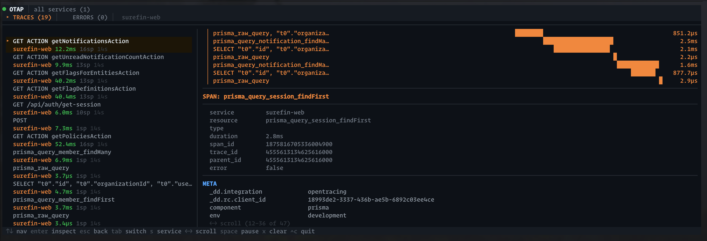

# otap

Local observability TUI — tap into Datadog traces, OpenTelemetry spans, and Sentry errors right in your terminal.



Single command. No config. Starts receivers, renders a TUI, tears down on exit.

## Quick Start

```bash
# Via brew
brew tap schester44/tap
brew install otap
otap

# Or run from source
./bin/otap

# Start your app — dd-trace already defaults to localhost:8126
DD_API_KEY=local SENTRY_DNS=http://key@localhost:8137/1 yarn start

# Or with OpenTelemetry
OTEL_EXPORTER_OTLP_ENDPOINT=http://localhost:4318 node --import ./instrument.mjs app.js
```

## What It Does

Embeds three HTTP receivers and a terminal UI in a single process:

- **Datadog receiver** (`:8126`) — accepts `dd-trace` msgpack payloads (`/v0.3/traces`, `/v0.4/traces`, etc.). Uses the default DD Agent port so no extra config needed.
- **OTLP receiver** (`:4318`) — accepts OpenTelemetry HTTP trace exports (`/v1/traces`). Works with any `@opentelemetry/exporter-trace-otlp-http` SDK.
- **Sentry receiver** (`:8137`) — accepts `@sentry/node` envelope payloads (`/api/{id}/envelope/`)
- **TUI** — OpenTUI React app with trace waterfall, span inspection, error viewer, keyboard navigation

Use `--drop` to filter noisy spans by resource pattern.

## Keyboard

| Key | Action |
|-----|--------|
| `↑↓` / `jk` | Navigate list |
| `enter` | Inspect span tags/meta/metrics |
| `esc` | Back to trace list |
| `Tab` | Switch Traces ↔ Errors |
| `s` / `S` | Cycle service filter forward/backward |
| `←→` / `hl` | Scroll detail pane |
| `PgUp/PgDn` | Jump 10 items |
| `Space` | Pause/resume |
| `x` | Clear all data |
| `Ctrl+C` | Quit |

## Filtering Noisy Spans

Drop spans matching a resource substring with `--drop`:

```bash
otap --drop health_check --drop "SELECT 1"
```

## Multi-Service Support

Captures traces from **all** instrumented apps on your machine (any app sending to `localhost:8126`). Press `s` to cycle through discovered services as a filter.

## CLI

`otap` doubles as a CLI for querying data from a running instance. Output is JSON — pipe to `jq` or use from scripts and AI agents.

```bash
otap summary                       # trace/error/service counts
otap services                      # list discovered services
otap traces                        # recent traces
otap traces --service risk-api     # filter by service
otap traces --limit 10             # limit results
otap trace TRACE_ID                # single trace with all spans
otap errors                        # recent errors
otap errors --level error          # filter by level
otap clear                         # wipe stored data
otap help                          # full usage
```

## Configuration

| Env Var | Default | Description |
|---------|---------|-------------|
| `DD_PORT` | `8126` | Datadog receiver port |
| `OTLP_PORT` | `4318` | OTLP/HTTP receiver port |
| `SENTRY_PORT` | `8137` | Sentry receiver port |

## Requirements

- [Bun](https://bun.sh) — dependencies auto-install on first run
